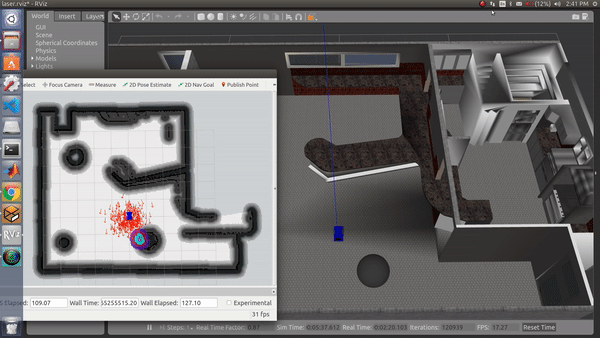

# NavRos

## Autonomous Navigation for Differential Drive Robots
### (Includes Gazebo simulation)

More information on the project : [Blog post](https://yainnoware.blogspot.com/2019/04/ros-navigation.html)

### Getting Started

- `cd catkin_ws/src`
-  Clone this repo here : `git clone "https://github.com/YugAjmera/navros_pkg"`
- `cd ..` (Go back to catkin_ws/)
- `catkin_make`
- `source ./devel/setup.bash`
- `source ~/.bashrc`

If catkin_make fails (probably `controller_manager` package does not exist)
```
sudo apt-get install ros-kinetic-controller-manager
```

### Gazebo Simulation

(Skip this while working with real robot)

Change the [urdf file](https://github.com/YugAjmera/navros_pkg/blob/master/urdf/car.urdf.xacro) as per the dimensions of your robot.

Install pointcloud_to_laserscan :
```
sudo apt install ros-kinetic-pointcloud-to-laserscan ros-kinetic-rosbridge-server
```

On a new terminal :

To launch the urdf model in Gazebo in a custom cafe environment :
```
roslaunch navros_pkg cafe_custom.launch
```
To launch the model in empty world in Gazebo :
```
roslaunch gazebo_ros empty_world.launch
roslaunch navros_pkg urdf_gazebo_view.launch
```
Keep this terminal running for all the next steps.


### Laser sensor (Lidar or Kinect)
On a new terminal :

Run RVIZ :
```
cd catkin_ws/src/navros_pkg/rviz 
rviz -d laser.rviz
```
Check if the laser readings are seen in RVIZ.
After the laser readings are visible,close this terminal.


### Mapping
On a new terminal :

Run SLAM :
```
roslaunch navros_pkg gmapping.launch
```

Run RVIZ :
```
cd catkin_ws/src/navros_pkg/rviz 
rviz -d map.rviz
```

- For Octomap:
```
roslaunch navros_pkg octomap.launch
```

Run RVIZ for Octomap:
```
cd catkin_ws/src/navros_pkg/rviz 
rviz -d octomap.rviz
```

Run teleop_twist_keyboard :
```
rosrun teleop_twist_keyboard teleop_twist_keyboard.py 
```

Drive the robot around the environment you want to map.

Once mapping is complete,
Save the map:
```
 rosrun map_server map_saver ~/catkin_ws/src/navros_pkg/maps/name_of_map
 ```

Now,close this terminal.


### Autonomous Navigation
Define the size of your robot :
```
roscd navros_pkg/param/
gedit costmap_common_params.yaml 
```
`footprint: [[-x, -y], [-x, y], [x, y], [x, -y]]`
where x= robot_length/2 
and y= robot_width/2


Run amcl.launch :

Replace `name_of_map` with the map name you saved in the previous step.
```
roslaunch navros_pkg amcl.launch map:='name_of_map'
```

Run move_base.launch :
```
roslaunch navros_pkg move_base.launch 
```

Run RVIZ :
```
cd catkin_ws/src/navros_pkg/rviz 
rviz -d navigate.rviz
```

* Set initial pose (Click "2D pose estimate" and pinpoint the approximate location of robot on map). 
* Red arrows indicate the probable location.
* Set goal for the robot in RVIZ (Click "2D Nav goal" and pinpoint the desired goal on the map).
* Green line indicates the path planned.



View [work-flow here](https://github.com/YugAjmera/navros_pkg/blob/master/workflow.md) 

